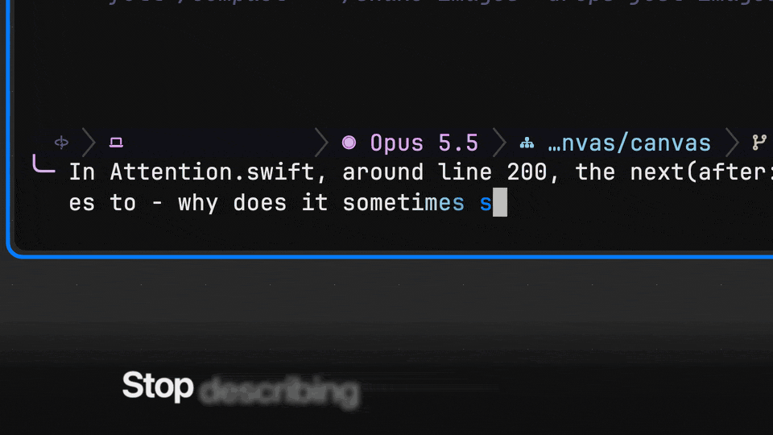

# Canvas

**Stop describing code to your agent.**



Canvas is a Mac app for coding agents: Claude Code, Codex and any CLI agent run unmodified in real terminals next to the whole file, with your language server and a git gutter against your branch. Hyper-click (⌃⌥⇧⌘-click) a line of code, a DOM element, a note paragraph or a command's output, and it goes with your next prompt, instead of "around line 90". Quit, crash or rebuild the app and your agents keep running in their [zmx](https://github.com/neurosnap/zmx) sessions. Claude Code, Codex, opencode and Gemini CLI (before 0.60) need no setup; [omp](https://github.com/can1357/oh-my-pi) is the first-class agent.

Native Mac app. Free, MIT.

Requires macOS 14 or later on Apple silicon. [Download the latest release](https://github.com/twaldin/canvas/releases), then follow [Install](#install) and [First steps](#first-steps).

## Show your agent the code

Hyper-click a line of code, a DOM element, a note paragraph, a command's output, a shape or a group's title (the whole group, with the arrows between its members) to stage a mention in the tray at the bottom of the window. It goes with the next prompt you submit to the terminal the tray targets (`→ name ▾`); a mention from another worktree targets the agent working there. ⇧⌘M mentions whatever the keyboard is on. For an agent without an integration, Hyper-V (⌃⌥⇧⌘V) pastes the mentions into the terminal you're typing in, without pressing Return.

Hyper means all four modifiers, ⌃⌥⇧⌘. Hold them and click, or give yourself one key that sends all four: Caps Lock mapped to Hyper with [Karabiner-Elements](https://karabiner-elements.pqrs.org) is the usual setup, and any remapper that sends ⌃⌥⇧⌘ works.

## Quit the app. Your agents keep working.

Terminals live in zmx sessions, so quitting Canvas, a crash, a rebuild or closing a board's tab ends nothing: agents and shells keep running and are back when you open the folder again. An agent that finishes while Canvas is closed comes back done (or blocked) with its answer. After a reboot, omp, Claude Code and Codex tiles relaunch with their recorded session. Closing a terminal tile ends its session; ⌘Z brings the tile back with a new one. To see or end sessions without the app: `zmx list` (Canvas's are named `canvas-obj_…`), `zmx kill <name>`.

Terminal tiles are rendered by libghostty and use your Ghostty config (theme, colors, font family, keybinds; Canvas keeps its own font size, and zoom scales text). A program's notification or bell becomes an attention marker, and ⌘-click opens a `path:line` in the output as a code tile.

## See which agent needs you

Each agent's state is on its tile: blue working, orange needs you (an approval or a question, in a bubble with its message), green done and not yet seen. ⌘J goes to whoever needs you next: blocked agents first, then marked tiles, then finished agents you haven't seen. When Canvas isn't in front, macOS notifications tell you, and a background board's tab shows a dot.

Which agents report their state and get your mentions:

- **Claude Code and Codex:** no setup, only inside Canvas. Canvas's wrappers come first on a terminal tile's PATH and load the hooks and the canvas skill per session; nothing is written to your global agent config. `CANVAS_AGENT_HOOKS=0` turns this off.
- **opencode:** no setup, through a plugin Canvas adds per session.
- **Gemini CLI:** no setup before 0.60. Gemini 0.60 and later runs as a plain terminal, without a state dot.
- **omp:** the Canvas extension (one symlink, [Install](#install) step 4). omp's `browser` tool also drives browser tiles.
- **aider and any other CLI:** green when they send a terminal notification saying they're waiting; no working or needs-you state. Hyper-V pastes your mentions into them.

## See what it changed

Each agent terminal has one follow tile: the file the agent last read or edited, with a history strip and its edited rows flashing. Code tiles show the whole file scrolled to a range, with a gitsigns-style gutter against the merge-base (or HEAD); click a sign to peek at the old lines. A code tile can follow a branch instead of a checkout: it reads the branch's worktree live while one has it checked out, its commit once the worktree is gone, and after the merge says "merged in <sha>" and keeps showing the code. Your language server gives them hover, go to definition, references and outline; without one, the last three answer by text search.

Changes tiles review an agent's work like a PR: uncommitted changes, the branch against its default branch, or against any commit. Stage, unstage or discard files, hunks and lines. They also show any branch or fetched pull request against its base straight from git, no checkout needed, read-only, with the same hunks and Viewed boxes. ⌘Z undoes agents' changes too, and says what it undid.

## The code it means

The agent points back the same way: it opens the exact code it means beside its terminal, draws arrows between things, and leaves notes and walkthroughs you step through with ⌥⌘→. What it creates lands next to its terminal and says "by <terminal name>" in its title bar; the view never moves by itself.

## Also on the canvas

- **Notes.** Markdown with fences that stay live against the files they quote; a `propose` fence renders as a diff, and a fence whose code moved away says it's stale.
- **HTML tiles.** Sandboxed explainers with a bundled kit (Mermaid, code excerpts); agents chain them into walkthroughs.
- **Browser tiles.** Agents drive them: omp with its `browser` tool, Claude Code, Codex and any other CLI with `canvas browser` (snapshot, click, type, eval, screenshot). The page's errors show on the tile.
- **Image tiles.** An image file with a caption, reloaded when the file changes.
- **Diagram tiles.** Who calls a function, or what it calls, computed live by your language server: symbol-anchored nodes with the lines making each call. Click a node to open its next level, click its `path:line` for the code, Hyper-click to point your agent at it; a deleted function stays with a stale badge instead of vanishing.
- **Drawing.** Shapes, arrows (straight, orthogonal, or routed around tiles), ink, and titled group regions.
- **One board per repository.** Every worktree and branch of a repo opens the same board, rooted at the main checkout; opening a worktree names it in the window, starts new terminals there, and goes to its branch's region. Boards Canvas kept per branch before are merged into their repository's board once, each branch's as a region (the old files are kept in `boards/pre-repo-migration/`).
- **Getting around.** Go to… (⌘P) searches every group and tile by title, path, or note heading and takes you to the one you pick. When you've panned into empty space, a "Back to content" pill brings you home, and Zoom to Fit (⌘9) frames the main cluster of work instead of shrinking to fit a few far-off strays.
- **Agent API.** A local socket with a JSON schema, a Python SDK, a TypeScript client, and the `canvas` CLI, which is on PATH inside Canvas terminal tiles and needs bun. Agents create and lay out objects in atomic batches, measure and fit content, render any region offscreen without moving your view, read the board's activity history, and hand each other board objects instead of re-describing them. Scripts that keep a board current (a region per ticket) name objects with a key and upsert them, so every run updates the same objects.

## Install

Requires macOS 14 or later on Apple silicon.

1. Download `Canvas-<version>.zip` from [Releases](https://github.com/twaldin/canvas/releases), unzip it, and move `Canvas.app` to `/Applications`.
2. The app is ad-hoc signed, not notarized, so Gatekeeper blocks the first launch. Clear the quarantine flag:
   ```sh
   xattr -dr com.apple.quarantine /Applications/Canvas.app
   ```
   Or open it once, then choose **Open Anyway** in System Settings › Privacy & Security. On macOS 14, right-clicking the app and choosing **Open** also works; macOS 15 removed that shortcut.
3. Install the runtime tools. Terminal tiles need zmx. The `canvas` CLI, the Claude Code and Codex hooks, and the omp extension need [bun](https://bun.sh).
   ```sh
   brew install neurosnap/tap/zmx oven-sh/bun/bun
   ```
   The Python SDK needs Python 3.11 or later; macOS's own `python3` is 3.9 (`brew install python` for a newer one).
4. Optional, for omp: install the Canvas extension. omp sessions started in a Canvas terminal tile then report their lifecycle, drive follow tiles, and get the canvas skill.
   ```sh
   mkdir -p ~/.omp/agent/extensions
   ln -sf /Applications/Canvas.app/Contents/Resources/extensions/omp/canvas.ts ~/.omp/agent/extensions/canvas.ts
   ```
5. Optional, for code navigation: install the language servers you want (sourcekit-lsp, pyright, typescript-language-server, gopls, rust-analyzer). Without one, Go to Definition, Find References and Outline answer by text search. Install commands, and how Canvas finds a server (`CANVAS_LSP_<LANGUAGE>` overrides one), are in [docs/install.md](docs/install.md#language-servers).

## First steps

1. Open Canvas. It opens a board on your home folder, with **Get Started** beside a practice note. Closed, it stays closed; Help › Get Started brings it back.
2. Hyper-click the practice note: hold ⌃⌥⇧⌘ (Control, Option, Shift and Command) and click a paragraph. A purple chip, the mention, appears in the tray at the bottom of the window. No Hyper key yet? Select the note and press ⇧⌘M, or give yourself one key: in [Karabiner-Elements](https://karabiner-elements.pqrs.org), Complex Modifications › Add predefined rule › "Change caps_lock to command+control+option+shift".
3. Press ⌘T for a terminal and run your agent: `claude`, `codex`, `opencode`, or `omp` with its extension (Install step 4). Codex first asks whether to trust the folder.
4. Ask it something, like "what does this note say?". The chip goes with your prompt, and Get Started checks off both steps.
5. Open your project with File › Open Board… (⇧⌘O), open a file as a code tile with ⌘O, and Hyper-click a line of it.

## Uninstall

End the terminal sessions first, or they keep running: `zmx list`, then `zmx kill <name>` for each `canvas-obj_…` session. Then delete `/Applications/Canvas.app` and the files Canvas writes, listed step by step in [docs/install.md](docs/install.md#uninstall). Canvas edits no shell, agent or Ghostty config.

## Build from source

The Command Line Tools are enough; Xcode is not required. Client generation and the omp extension need [bun](https://bun.sh), and the Python SDK's tests need Python 3.11 or later.

```sh
swift build                    # debug build
scripts/bundle.sh release      # assemble .build/Canvas.app (ad-hoc signed)
swift run CanvasCoreTests      # test suite (an executable target; see Package.swift)
bun scripts/gen-clients.ts     # regenerate the Python/TS clients from schema/canvas-api.json
```

`scripts/dev.sh` runs an isolated development instance. See [docs/testing.md](docs/testing.md).

## Docs

- [docs/install.md](docs/install.md): language-server lookup and the full uninstall.
- [docs/design.md](docs/design.md): the design record, covering principles, architecture, and decisions.
- [docs/contracts.md](docs/contracts.md): the API, tile, and scene contracts.
- [docs/testing.md](docs/testing.md): behavior tests and a development instance.
- [docs/releasing.md](docs/releasing.md): signing, notarizing, and publishing a release.
- [skills/canvas/SKILL.md](skills/canvas/SKILL.md): how agents work on the canvas.

## Support, contributing, security

Bugs and questions go in [GitHub issues](https://github.com/twaldin/canvas/issues). To contribute, build and run the tests above ([docs/testing.md](docs/testing.md)) and open a pull request. Report vulnerabilities privately, as [SECURITY.md](SECURITY.md) describes.

## License

MIT. See [LICENSE](LICENSE).

Terminals are [Ghostty](https://ghostty.org)'s, through [libghostty-spm](https://github.com/Lakr233/libghostty-spm); code tiles highlight with [tree-sitter](https://tree-sitter.github.io) and notes parse Markdown with [swift-markdown](https://github.com/swiftlang/swift-markdown); sessions are [zmx](https://github.com/neurosnap/zmx)'s (installed separately, not part of the app). Every third-party component in the app and its license is in [THIRD_PARTY_NOTICES.md](THIRD_PARTY_NOTICES.md), which ships inside `Canvas.app` too. One of them, GNU libintl (inside libghostty), is under the LGPL 2.1: the notices say where its source is and how to relink Canvas with a modified copy.
