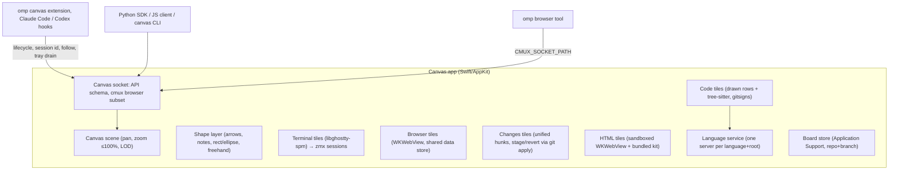

# Canvas — design record

A native macOS infinite canvas where coding agents run unmodified in real terminal tiles, next to browser, code/diff, note, and HTML tiles that both you and the agents can read, create, and change. The transcript stays in the agent's own terminal UI; the canvas holds the current working state.

Source: the original brainstorm (private) and the grilling session that produced this record.

## Principles

- **Terminal-first.** Agents (omp first) run their real TUI in a terminal tile. We never rebuild the agent's UI; every omp command, login flow, and question tool keeps working.
- **Own our protocols.** Depend only on public, intended interfaces: omp's extension API, AppKit/WebKit, libghostty-spm (pinned), the zmx CLI. Never impersonate another product. One sanctioned exception: the browser speaks a cmux-compatible socket subset so omp's native `browser` tool drives our tiles (revisit later).
- **Grounded, not decorative.** Code shown on the canvas comes from real files and real language-server answers. Authored content (notes, free-written snippets, HTML) is visibly styled as authored.
- **Cheap on a shared machine.** Lazy everything, bounded concurrency, detach what you can't see. Resource budget is a first-class requirement (see Performance).

## Architecture



## Decisions

### Interaction

| Input | Action |
| --- | --- |
| Click | Select to edit, move, drag |
| Right-click | Context menu |
| Shift-click | Add/remove from selection |
| Drag on empty canvas | Marquee select (box or lasso, a setting) |
| Hyper-click (Caps Lock → ⌃⌥⇧⌘ via Karabiner) | Stage/unstage a mention |
| Hyper-drag on empty canvas | Marquee mention (one group mention) |
| Hold Hyper | Outline what would be mentioned under the cursor |
| ⌘G / double-click group | Named group; double-click enters it (zoom + dim the rest) |
| ⌘P | Go to… navigator (see Navigation) |
| ⌘= (⌘+) / ⌘- / ⌘0 / ⌘9 | Zoom in / zoom out, through browser-like levels (10, 15, 25, 33, 50, 67, 75, 90, 100%) / actual size (100%; with a selection, the selection at 100%) / zoom to fit |
| ⌥⌘←/→/↑/↓ | Move to the nearest tile that way from the focused or selected tile (or the viewport center), preferring tiles in line with it (sharing at least a quarter of the narrower span across the heading: ↓ goes to the tile below, not to one beside it that reaches down; `Layout.neighbor`): the least pan that shows it; a terminal takes focus, anything else is selected with the canvas holding the keyboard |
| ⌘W | Close the selected objects, else the focused terminal (terminals through the close sheet, Return confirms); with neither, the tab or window |
| ⌘F | Find in the focused or selected code tile |

- Canvas navigation shortcuts (⌘P, ⌘9, ⌘0, ⌘= / ⌘+, ⌘-, ⌥⌘-arrows, ⌘W) work wherever keyboard focus is, including a terminal or web page: the window takes them before the focused view (Ghostty binds ⌘0/⌘=/⌘-/⌘9 to font size and tabs, ⌘W to close surface, ⌥⌘-arrows to go to split; a web view ⌘=/⌘- to page zoom; shells never see ⌘). In a focused terminal every other menu shortcut (⌘T, ⌘N, ⌘O, ⌘Z, ⌘G, ⌘⇧[/], ⌘Q …) also beats Ghostty's bindings, which give ⌘T, ⌘N, ⌘Z, ⌘Q and ⌘⇧[/] to tab, window and app actions the embedded library can't perform; Copy, Paste, Select All and ⌘⌫ (Ghostty's delete line) stay with the terminal. ⌘F goes to a code tile when one is focused or selected, else stays with the terminal or page.
- The keyboard always lands somewhere: going to a tile by keyboard (Go to, ⌥⌘-arrows, a new object the user asked for) focuses a terminal and otherwise leaves the keyboard with the canvas, so Delete, Esc, ⌘W and ⌘G act on the selection; closing the tile that had it hands it to the canvas too. Editing keys (⌘C, ⌘V, ⌘A, typing) stay with the focused view.
- Hyper is caught by an app-level event monitor before any tile, so native ⌘-click keeps working everywhere (terminal links, browser new-tab, go-to-definition).
- Mentions work at element level inside tiles: DOM element, code line or symbol, terminal line/selection, any canvas object.
- **Selection tray**: a fixed window-space bar showing staged mentions as chips and which terminal will receive them (`PromptTarget`): the last focused terminal running an agent (one of known kind reporting a lifecycle), else the last focused terminal, else the board's only one, so opening an editor or a shell beside an agent never takes its mentions. The tray names it by its `name`, else the title it shows (an agent's OSC title), else "Terminal". Its hint says what Hyper is (⌃⌥⇧⌘). Staging is explicit and never undone automatically: edits keep the chip (with an "edited" badge), deleting the object or closing its tab removes it, the chip's X removes it. A DOM element's chip leads with what a person recognizes and ends with its CSS path, where a long label is cut: `"navigation" · strong · <tile title> · body > main > … > strong`.
- **Drain**: the mentions go to the terminal the tray shows, nowhere else. The agent integration (omp extension, Claude Code and Codex hooks) attaches all staged mentions (pinned to their revision at submit time) to the next prompt you actually submit in that terminal, then clears the tray; a prompt in any other terminal leaves the tray alone. In the context a mention of the receiving terminal itself says "your terminal" and other terminals are named, so "this terminal" never points an agent at the wrong tile. Synthetic turns (queued follow-ups, advisor, background-job wakes) never drain. Other agents: Hyper-V (⌃⌥⇧⌘V, Edit ▸ Paste Mentions into Terminal) pastes the context block into the target terminal without pressing Enter and clears those chips; the tray says so while chips are staged. Scripts can `canvas tray.drain`.
- **Prompting**: keyboard focus stays in the target terminal while the mouse draws and selects; Superwhisper pastes into that terminal. Hyper-click never moves keyboard focus: staging leaves it wherever it was (the canvas, a page, a terminal), so a key meant for the canvas (Esc for a menu or a selection) never reaches an agent the user didn't click into. No in-app composer, no in-app voice.
- **First run**: an empty board shows a quiet centred hint: ⌘T (or right-click → New Terminal Here) for a terminal, then run your agent (omp, claude, codex), and what Hyper-click does. It is transparent to the mouse and disappears once the board has an object.
- Your ink never means anything by itself. When you mention a drawn object, the canvas resolves what it encloses, overlaps, and connects; the agent reads that as structure (`--as graph`) or a picture (`canvas render <id>`).

### Canvas and drawing

- Native AppKit scene; tiles are real NSViews in one coordinate system with a vector overlay above them.
- Our own shape layer, not tldraw (source-available license, web-only): arrows bound to objects, notes, text, rectangle/ellipse, freehand ink. Hand-drawn feel from MIT/OFL parts (perfect-freehand, rough.js ideas, Shantell Sans). No tldraw code or assets.
- Drawing tools are one-shot: rectangle, ellipse, arrow, and text return to Select after one shape, so a forgotten tool can't turn the next drag across a terminal into a shape; ink stays on for multi-stroke drawing until Esc or V. The active tool sits on an accent pill in the toolbar.
- One object type for user and agent. Every object records creator and edit history. Agents may edit and move your objects when you're collaborating (guided by the shipped skill); every agent change is undoable with ⌘Z. Agents never move your viewport unless you ask; they can raise an attention marker instead.
- Agent-created objects spawn near the agent's terminal, clear of everything else on the board (other agents' tiles and groups too) and, when the terminal is on screen and there's room, inside the user's view. A follow tile that doesn't fit in view at full size beside an on-screen terminal takes a smaller spot that does (down to 400×300 pt, still readable code) rather than land half outside; the view never moves for it. Automatic spawns are limited to the agent's follow tile and its browser.
- **Zoom**: capped at 100%. Zooming never redraws the scene: tiles, group titles and borders, drawings, and selection rings are all in document space and keep their size relative to everything else at every zoom (only window chrome, the dot grid, shape resize handles, and attention markers stay screen-sized). An attention marker is the one thing that must stay readable from anywhere, so it lives in a window-space layer above the canvas and is re-placed around its object on every pan and pinch step: it hugs the object smoothly through a pinch, at a fixed on-screen size. Below ~30% (terminals ~15%) tiles become snapshot or title cards and live views detach (Ghostty occlusion, WebKit suspension). Cards look exactly like the live tile: code cards draw the tile's own header view and its rows at its scroll, HTML and browser cards are captures of the live page. A card replaces the live view only once it has been drawn (never a blank or title-only flash); going live, the card stays over the content until the content is ready (a web page loaded, settled, and presented, at most 2 s), so the swap never shows a blank or half-loaded page; and flips have hysteresis (cards below 90% of the live zoom; offscreen past 600 pt, live again within 300 pt). Below 30% every tile is one handle (click selects, drag moves) with its agent's lifecycle wash. The dot grid is a Core Animation layer behind the document that follows every pan and pinch step: dots stay 2 pt on screen and the next finer level fades in and out (`RenderMath.gridLevel`), so zooming never pops them. "Zoom in" means focusing a tile at 100%.
- **Scale**: nothing grows by itself to stay readable when you zoom out; you make an object bigger. A plain corner drag resizes a tile and its content reflows; ⌥-drag scales it: the proportions and layout stay, and everything inside (title bar, text, page, terminal) grows with the box. The right-click menu's Scale submenu has 50–200% and Reset. A text shape's corner always scales it, box and font together. The scale is `props.scale` (0.25–8), so agents can set and read it too. A scaled-up tile stays live further out, because its content is bigger on screen. Code, note, and web content redraws sharp at any scale; a terminal above 100% on screen is magnified from Ghostty's surface, as when zooming in.
- One canvas per directory (repo or worktree); tiles may override the root.
- A file outside the board root (typically in another worktree) is named `<worktree or repo directory>/<repo-relative path>` in tile titles, Go to, tray chips and mention labels, with the full path in a tooltip; the API keeps absolute paths.

### Navigation

Getting lost on a big board must always have a one-step way back.

- **Go to… (⌘P)**: a floating panel inside the board window (an overlay like the drawing toolbar, not a separate window and never modal) with a search field and a list: "All content" first (Zoom to Fit), then groups by title, then tiles, each in reading order (top to bottom, then left to right). A tile row shows its title (code: path and line range; notes: their first line; browsers: the page title), a small type label, and the agent lifecycle dot for terminals; a browser row's subtitle is its host (and port), a code tile's its caption (six excerpts of one file read apart), and rows whose titles are equal add a subtitle (terminals: their `name`, else the command they started with, else their directory; browsers: the address without its scheme; code and other tiles: the caption, else the group's title). Typing filters by case-insensitive substring of the title, type, subtitle, and every tile's caption and name and a browser's address ("localhost" finds the dev server's tile); below the objects, the board root's files (`git ls-files`, plus untracked files git doesn't ignore) that the query fuzzily matches (a subsequence of the path, the file name ranked first, `FileIndex`), at most 50, as Open File rows: Return opens a code tile for the file in view and selects it. A line after the file (`core.py:1428`, `src/click/core.py:10-20`, `:12:7`, `#L10-L20`, `GoToQuery`) opens it there. `@name`, or a name no object or file matches, lists the language servers' workspace symbols (name, kind, container, `path:line`), which open a code tile at the symbol; ↑/↓ move, Return or a click goes, Esc, ⌘P, or a click outside closes. Going fits the object (zoom capped at 100%) and selects it; a terminal takes keyboard focus, anything else leaves it with the canvas. The move is a jump, not an animation: every intermediate frame would run the scene pass (live/card flips, grid and chrome rescales) across whatever the path crosses. ⌘P rather than ⌘K because Ghostty binds ⌘K (clear screen) by default and a focused terminal tile claims it before the menu.
- **Jumps land clear of the chrome**: Go to, Zoom to Fit, ⌘0 with a selection, an attention edge pill, a title-bar double-click, entering a group, and opening a board aim at the area between the floating toolbar and the tray (with a 12 pt margin), so title bars and URL bars never sit under the toolbar. An object too tall to read when fitted whole (below 50%, e.g. an 820×3100 HTML page) fits its width instead and shows its top.
- **Attention edge pills**: an object out of view that needs the user (a marker, or a terminal whose agent is `blocked`, pill text its lifecycle message, e.g. "approve Edit?") gets a pill at the edge of the view pointing at it; a blocked agent's pill goes when it stops being blocked. On screen, a blocked terminal gets a ring and a bubble with its lifecycle message, as prominent as a marker's, until the moment it stops being blocked; clicking the bubble selects the terminal and gives it the keyboard, so the user can answer. The two read differently: blocked means *needs your action* and wears the lifecycle's orange (its title-bar dot, the tab dot) with a raised hand before the message; a marker means *look here* and is pink, a color no lifecycle state or ink swatch uses. Both pulse. Clicking one jumps to its object like Go to (without selecting it or moving keyboard focus) and acknowledges the marker: the user went there. Clicking a marker's bubble acknowledges it too (and selects the object), and the empty canvas's menu has Clear Attention Markers for the whole board (markers aren't undo history). Edge pills and marker bubbles stay inside the area jumps aim at (between the toolbar and the tray), so neither sits under the chrome, and never cover each other (`PillLayout`): a bubble sits above its object when that covers no other tile, else on the object's own title bar, else as near to either as the other pills allow; no bubble covers a blocked terminal but its own (its prompt is what the user must read), and blocked bubbles are placed first; edge pills slide along their edge, off blocked terminals where the edge has room; a long message truncates to the object's width (at least 240 pt, at most 480) with the whole text in its tooltip.
- **Opened from a page**: a code tile opened by clicking a `<canvas-link>` or `<canvas-code>` in an HTML tile is user navigation, so when it lands outside the view the canvas pans the least that shows it; one already in view doesn't move.
- **User objects land in view**: an object the user creates without saying where (File › Open File, New Note, New Browser Tile, New HTML Tile, ⌘T, Go to's file rows, Edit Here's terminal beside its code tile) goes to the free spot nearest the viewport center (or that tile) inside the view clear of the toolbar and tray, by the agent placement rule (`Board.place`); when nothing fits, partly in view, and the canvas pans the least that shows it. It is selected and gets the keyboard. New Terminal, Note and Browser Here and Review Changes start at the click point and follow the same rule (`Board.place` from there, then the least pan when it doesn't fit).
- **Nothing here**: while the board has objects but none intersects the viewport, a pill at the bottom center says "Nothing here · Back to content"; its button runs Zoom to Fit. The scene pass decides it, stopping at the first object in view.
- **Zoom to Fit (⌘9)** fits everything when all of it fits at minimum zoom (10%). Otherwise it fits the largest cluster: objects whose frames lie within 1500 pt of each other, transitively (`Layout.clusters`); largest means most objects, then most area (`Layout.fitTarget`). Two stray terminals 40,000 pt from the other 130 objects used to clamp the fit at 10% centered on the empty space between them; now they're left out of it.

### Tiles

- **Terminal**: libghostty-spm surface running `zmx attach <session> <cmd>`. New terminals are 1000×620 pt, wide enough for omp's tables and diagrams; ⌘T opens one at the viewport center and New Terminal Here at the click point, each moved to the nearest free spot (`Board.place`), wholly in view clear of the toolbar and tray when there's room, else panned into view. Agents survive app quit, crash, and rebuild; after a reboot, agent tiles relaunch with their recorded session (`AgentResume`: `omp --resume=<id>`, `claude --resume <id>`, `codex resume <id>`). Deleting a terminal, by the user or through the API (`object.delete`, a batch), ends its session; ⌘Z brings the tile back with a new one. When the session's process exits (`exit`), Ghostty's "Press any key to close the terminal" is true: the key closes the tile through the normal delete path, without the confirmation (nothing is left to kill); a detached client reattaches instead.
  - **The user's Ghostty config**: tiles load it as Ghostty does (`~/.config/ghostty/config` or `$XDG_CONFIG_HOME/ghostty/config`, then `~/Library/Application Support/com.mitchellh.ghostty/config`, `config.ghostty` after `config` in each, `config-file` includes after them), so theme, colors, font family, padding, keybinds and selection colors are the user's own (`GhosttyConfig`, `TerminalConfig`). The embedded library follows no includes and bundles no themes, so the app flattens the files and reads a named theme from `~/.config/ghostty/themes` or an installed Ghostty.app; a line Ghostty rejects is dropped (logged in `app.log`) instead of the whole config. The library hands window, tab and split actions back to its host, and a key bound to one is claimed by the terminal even when the host does nothing (Tim's `keybind = super+t=new_window` swallowed ⌘T, and the next typing went to the agent), so the user's keybinds of those actions never reach it: `new_window`, `new_tab` and `new_split` become New Terminal beside the focused terminal (in its directory, then focused), `close_surface` closes it through the close sheet, and the rest (close window or tab, go to tab or split, fullscreen, quit, reload config, …) are dropped; `app.log` lists each. Canvas owns `command`, `initial-command`, `working-directory`, `wait-after-command`, keeps the background opaque, and owns `font-size` (tile sizes assume Ghostty's default and canvas zoom scales text; a size meant for a full-screen terminal would halve a tile's columns) and `background-image` (cards and renders can't draw it, so live/card flips would change the tile). Without a user theme, tiles keep Canvas's Alabaster (light) / Afterglow (dark). Cards and renders (`TerminalRender`) use the same colors, font, size and padding.
  - **Needs you**: OSC 9 and OSC 777 (`notify;title;body`) desktop notifications and BEL from any program raise an attention marker on the terminal (message: the notification, or "Bell"; raised by no agent), unless the terminal has keyboard focus in the active window or its agent reports a lifecycle (omp, Claude Code, Codex already show done and blocked on the tile; omp posts "Complete" after every turn). Repeats coalesce: the same message again changes nothing and a bell never replaces a notification's marker. Looking at the terminal clears it like any marker. Claude Code, Codex, and plain `printf '\a'` all reach the user this way, hooks or not.
  - **⌘-click `path:line`**: ⌘-hover underlines a reference in the terminal's text (`src/foo.ts:42`, `:42:7`, `:10-20`, `foo.rs#L10-20`, absolute and `~/` paths) that names an existing file, resolved against the directory the shell reported (OSC 7), then `props.cwd`, then the board root, then by name among the board root's files (`core.py:2535`, `click/core.py:10`: agents write bare names; a unique match, else the one nearest the terminal's directory, else none); ⌘-click selects the non-follow code tile already showing that path and range, else opens one beside the terminal (`Board.openCode`, `place(near:)`) and pans it into view. URLs and everything else stay Ghostty's.
  - Keyboard focus survives the tile turning into its card and back (panned offscreen, zoomed out) and `view.snapshot`: hiding a view takes AppKit focus, so the terminal takes it back when shown unless something else took it meanwhile.
- **Browser**: WKWebView, all tiles share one website data store (one browser profile, separate screens). Created lazily; snapshotted and detached when not visible. omp's native `browser` tool drives them through the cmux-compatible subset (`browser.open_split` spawns a tile beside the calling terminal); a driven page, and one an agent renders, stays visible to WebKit wherever its tile is (docs/contracts.md). The first click into a page acts on it (follows the link, presses the button) and selects the tile, also in an inactive window. The page's title is the app's write-back (`system` in `board.history`); its URL changes, same-document ones (pushState, back/forward between them) included, go to the address bar and `props.url`, credited to whoever last acted on the page within 10 s: the agent whose command drove it, the user who clicked or typed in it, else `system` (a redirect or timer later on). A page's `_blank` link, `window.open`, or ⌘-click opens a tile beside it; one the user opened is revealed (the least pan) and selected, and the same address asked again within 2 s gets that tile back rather than a duplicate. Right-click on the canvas → New Browser Here opens an empty tile at the nearest free spot with its address field focused. The page's own context menu offers Inspect Element (WebKit developer extras). The page's viewport is the tile's body at any zoom (`innerWidth` = frame width): WebKit rounds the web view's size to whole device pixels at the on-screen scale and floors it back to CSS pixels (at 90% a 648 pt tile was 647 px wide), so the web view's frame is rounded up to whole device pixels, re-snapped when the zoom settles.
- **Code**: read-only, one view (no diff/source modes): the whole current file scrolled to its range, with changes against the diff base (merge-base with the default branch by default, or HEAD) shown in context like nvim gitsigns: a green bar on added lines, blue on modified, a red wedge where lines were deleted; clicking a sign peeks the base lines inline. No commits, no default branch, or a diff too large shows plain source with a header warning; a deleted file shows its base version. Diff engine: `git diff --diff-algorithm=histogram` against a pinned base SHA; model follows VS Code's range mappings; both sides are highlighted with tree-sitter. Rows are drawn directly (a CTLine per visible row, `CodeMetrics` geometry), not by a text system, and long lines soft-wrap at the tile's width (no sideways scrolling); `size: "fit"` caps a code tile's width (960 pt by default) instead of stretching it to the longest line. "Edit Here" opens the user's editor (`$VISUAL`, else `$EDITOR`, read from an interactive login shell started fresh; else nvim, else vi) at file:line (`+line` for editors known to take it, `EditorCommand`) in a terminal tile beside the code tile. ⌘F opens a find bar on the tile: matches highlighted live, the count, Return / ⇧Return for next / previous (the tile scrolls to it), Esc closes.
  - **Follow mode**: each agent terminal has one follow tile that re-aims at the latest file:line it read, edited, or wrote, with a short history strip (the current location stays in view; edits and writes carry an orange pencil and outlast reads, so every edit of a parallel burst stays listed; the oldest reads drop off a narrow tile first); the rows an edit or write changed flash for ~3 s. It follows source only: images, PDFs, archives and other binaries, scratch files in the temp directory, and missing files never re-aim it (agents read their own render PNGs and delete them). While the user scrolls, clicks, or selects in it, re-aims wait ~10 s ("N new ▸" catches up). Pin turns the current view into a permanent code tile. An agent working in another worktree of the board's repository (a directory sharing its common git directory) is followed too: the tile shows that file by its absolute path, with gutter signs from its own worktree. Closing the follow tile turns following off for that terminal; the terminal's right-click "Follow Files" turns it back on (or off). Closing the terminal closes its follow tile.
  - Minimal editor features: hover signature, symbol highlight, go to definition (same tile or new tile), references (Open All lays them out as captioned excerpt tiles in a group beside the tile, like a multibuffer), next/previous change, outline (types, their members and top-level symbols, no locals; type to filter), canvas actions such as "open callers as graph".
  - **Changes**: one view of what changed, for reviewing an agent's work like a PR. It lists every file that differs from its base (`props.base`: HEAD by default, i.e. the uncommitted work, staged or not; merge-base; or a commit) under its `paths` (default the board root), untracked files as added, with status (A/M/D/R) and +/− counts; under each file its hunks as a unified diff (3 lines of context, grouped as `git diff -U3` groups them) highlighted with the code tile's tree-sitter colors. Deleted files start folded; a click on a file's header folds or unfolds it. It lists what `GitDiffEngine` diffs and reloads while live on working-tree, index, and ref changes, and after its own actions. Stage and Revert, per hunk and per file, patch the index or the working tree with `git apply` and are each one ⌘Z step (docs/contracts.md "Changes tiles"); there is no revert-everything button, and a hunk whose lines changed since the tile read them is refused with a message in its header. A hunk shows `staged` (or `committed`, for a base older than HEAD) once the index holds it. Clicking a line opens it in a code tile beside the tile (the topmost one showing that file re-aims instead), with the tile's base as the code tile's diff base. Keys: with the tile selected, j/k or ↓/↑ step through hunks and Return opens the current one; s (stage) and r (revert) only once the user clicked into the tile, so typing elsewhere can never trigger them; the header's tooltip lists them. Hyper-click on a line mentions it (the working-tree line, or the base line for a removed one, `side` and the base commit attached); on a hunk header, the whole hunk. Agents create one to show what they did (`size: "fit"` sizes it to every hunk) and read it back with `object.get`: the files and hunks as git has them now, next to `props.reviewed`, the Stage and Revert actions the user took. The empty canvas's menu has Review Changes (a tile for the board root at the click point).
- **Notes**: markdown. Code fences have three modes, all plain markdown for agents:
  - Excerpt: ```` ```ts file=path#L10-40 ```` or `symbol=Name`, rendered live from disk with full language features.
  - Proposed change: same anchor plus `propose`, rendered as a diff against the real range.
  - Free-written: plain fence, highlighted; `file:line` links resolve, identifiers get best-effort workspace-symbol navigation.
  - Anchors prefer symbols, re-find line anchors by content, show a stale badge when lost, and can be pinned to a commit.
- **HTML**: sandboxed WKWebView with a throwaway data store, network blocked by default (content rule list, per-tile allowlist), no native bridge except a validated message channel for tile state. Approvals never render inside generated tiles. Every tile preloads a locally served kit: Tailwind (themed to the app), Mermaid, and canvas web components (`<canvas-code>`, `<canvas-link>`, `<canvas-decisions>`, `<canvas-compare>`). `size: "fit"` lays the page out offscreen at the tile's width and takes its document height (up to 4000 pt), and `layout.check` reports a page taller than its tile.

### Agent layer

- Ours, under the `CANVAS_*` environment namespace (plus `CMUX_*` for the browser only).
- Lifecycle per terminal tile: `working`, `blocked`, `idle`, `done` (idle, not yet seen), `unknown`. Sources: our omp extension (authoritative), and our hook script for Claude Code and Codex (`extensions/agent-hooks`). No screen scraping in v0. omp announces approvals only for its registered tools, not for eval's `browser`/`computer` preludes, so the omp extension watches the approval dialogs themselves (wrapping `select` on its UI context; docs/contracts.md "Lifecycle authority"): every approval prompt shows `blocked` until answered. The hooks name each approved tool call (`agent.report` `call`), and a tile stays `blocked` while any call waits for its approval, whatever parallel calls or subagents finish meanwhile; a queued approval comes up when the one before it is answered. `agent.prompt` refuses a `blocked` agent (its dialog would swallow the text) unless forced. An agent that exits (`agent.release`) leaves the tile a plain shell: its recorded session is forgotten, so a reboot doesn't resume what the user quit. The tray offers Hyper-V only for targets without an integration that takes mentions itself.
- Claude Code and Codex get the same integration as omp with zero setup, only inside Canvas: tiles put Canvas's `claude`/`codex` wrappers first on PATH (a zsh `ZDOTDIR` and bash `PROMPT_COMMAND` shell integration re-prepends Canvas's bin after the user's startup files), and each wrapper execs the real binary with this session's integration: Claude Code loads the plugin in `extensions/claude` (`--plugin-dir`: hooks plus the canvas skill), Codex gets its hooks as a `-c` override that also trusts exactly those hooks. Nothing is written to `~/.claude`, `~/.codex`, or the repo; outside a tile, or with `CANVAS_AGENT_HOOKS=0`, the wrappers exec the real binary untouched (docs/contracts.md "Agent integrations").
- "Seen" means the tile was focused, or visible at readable zoom in the frontmost window for a few seconds.
- Session memory: each tile records agent kind and session id for resume.
- Attention markers belong to a turn: an agent's new marker clears the ones it raised before its lifecycle last went to `working` from idle, done, or no state (the user's latest prompt), while markers from the same answer stay together, including those raised before an approval the user answered (blocked → working continues the turn). Unseen markers are stored with the board, so they survive restarts.
- Agent-to-agent: `canvas agent list|prompt|wait|read`, across all canvases in the app; each agent is listed with its board and that board's root directory. A wait is a read, so the clients re-send it when an app restart cuts it off, with the time it has left.
- Notifications: tile badges, lifecycle color on zoomed-out cards, a ring and bubble on a blocked agent's terminal on screen and an edge pill for one out of view, a dot on the board's tab (orange: an agent on it is blocked; a quieter green: one finished unseen, `done`; nothing for working or idle; the tooltip names it and its message, `NeedsYou`), so an agent waiting on a background tab is seen, macOS notifications when the app is not frontmost, and attention markers from terminal notifications and bells (OSC 9/777, BEL) for programs without a lifecycle integration.

### Language service

- The app owns its language servers: one per (language, root), lazy start, idle shutdown, shared by all tiles. Tree-sitter parses are cached per file (path + content hash).
  - Root: the nearest project marker above the file (Package.swift, pyproject.toml, tsconfig.json/package.json, go.mod, Cargo.toml, …), never above the board root. Servers: sourcekit-lsp, pyright-langserver, typescript-language-server, gopls, rust-analyzer; a missing binary is reported as unavailable with its install command (typescript-language-server needs `typescript@5`: TypeScript 7 has no tsserver). Outline lists symbols in source order with their line numbers.
  - Binaries and PATH come from the login shell (`$SHELL -lc`), resolved once: GUI apps get launchd's minimal PATH, and script servers (pyright) need node on it.
  - Idle shutdown after 5 minutes without requests; at most 4 servers at once (least recently used stops first, even mid-initialize). Quit waits for every server to exit (exit, SIGTERM, SIGKILL after 2 s). A crashed server surfaces its exit reason and restarts on the next request.
  - Documents are client-owned only while a request needs them or a code view shows them (ref-counted); before every request each open document whose file changed on disk is re-sent (full didChange), so no file watching is needed and closed files are read from disk by the server.
  - Code views implement `CodeNavigationHost`; `CodeNavigation` adds hover (500 ms, cancelled on move), ⌘-click definition (same file re-aims the tile, other files open a tile beside it, ⌥⌘ always opens one), Find References and Outline. Their popovers live in the canvas document, so they pan/zoom with the tile, never take focus, and appear in `view.snapshot`.
  - sourcekit-lsp runs with background indexing off (`initializationOptions.backgroundIndexing: false`): on a shared machine, opening a code tile must never start a `swift build` in the user's repo. Definitions and references come from the index the user's own builds write (SwiftPM indexes debug builds), and an empty answer says so. Until SwiftPM has loaded the package, sourcekit-lsp answers from fallback settings that can't see other files.
- omp keeps its own servers for now. Later: `canvas lsp-proxy <server>` configured as omp's server command, so each root runs one server.

### API and clients

- The **API schema** (method catalog over the Unix socket) is the single source of truth.
- v0 clients, generated or thin over the schema:
  - **Python SDK**: first-class, recommended for any agent with a persistent REPL.
  - **CLI**: for agents without a REPL.
  - **TS client**: used by the omp extension and usable from JS eval.
- MCP later, as another wrapper over the same schema.
- A shared `~/.canvas/compositions/` folder, auto-imported by both SDKs, holds reusable helpers agents write and improve; each SDK also ships its own built-in compositions, which user ones shadow by name.
- The shipped default skill (`skills/canvas`): persistent REPL → Python SDK; otherwise → CLI; touch user objects only when the user is collaborating. Every agent integration gives its agent one canvas-awareness block (`extensions/guidance.ts`) only when `CANVAS_ENV=1`: omp's skill discovery can't be extended by an extension and Codex has no per-session skill root, so for them it announces the skill (name, description, absolute path); Claude Code gets it as the plugin's `canvas:canvas` skill. Nothing is added to the user's global agent config.

### Persistence

- Terminals: zmx sessions.
- Boards: `~/Library/Application Support/Canvas/boards/`, keyed by the repo's shared git directory plus branch/worktree; a board file holds its objects, the staged tray, and unseen attention markers. Boards survive worktree deletion as archived boards; "export to repo" commits one on request.

## Performance

- Git: one invocation per canvas root for all visible files, merge-base resolved once and re-resolved on HEAD/branch change, triggered by debounced FSEvents, only for live tiles, cached by (base SHA, content hash), at most two concurrent git processes app-wide.
- Terminals: a surface renders only while its tile is live and its window shown; offscreen, zoomed out below 15%, covered, minimized, other-Space, background-tab, and hidden-app windows all stop Ghostty drawing (its display link stops), and the zmx session keeps running; shown again, it draws the current screen. Visibility is re-checked on occlusion, miniaturize/deminiaturize, active-Space, and app hide/unhide changes, and again on the next main-loop turn: `occlusionState` lags the miniaturize notifications. A surface is Ghostty-focused only while it's first responder of the key window, from the moment it attaches: Ghostty starts surfaces focused, and a focused surface runs cursor-blink and termios-poll timers even while hidden. Between 15% and 30% a terminal stays live, still updating, instead of swapping to a redraw in another font. Browsers: detach and snapshot when not visible, with a capped snapshot pixel budget; a page an agent is driving stays visible to WebKit for 60 s after its last command.
- Cards are 0.6 px/pt bitmaps, dropped as soon as the tile is live again; terminal cards read `zmx history` on GCD, not the main thread.
- Notes lay out their whole text once per content change (`NoteDisplayView`). TextKit 2 otherwise lays out a viewport around what's visible, and on the canvas that followed every pan and pinch step: each step re-laid out and resized every note on screen, sometimes never converging. One note on the astra replica stalled a pinch for 2 s (the "application not responding" beachball) and once raised AppKit's layout-loop exception.
- `view.render` encodes its image off the main thread (a full-board PNG took ~300 ms of the canvas's main thread).
- Blocking work (subprocess pipes, `waitUntilExit`, file reads) never runs inside a Swift task: parked cooperative threads starve the socket servers' request tasks. Use GCD plus a continuation.
- Agent-built boards (the architecture explainer: one 128-op `object.batch` creating 67 fit code tiles, 3 notes, an HTML tile, 10 groups, 38 line-bound `avoid` arrows, 8 grids and a stack). `layout.check` judges a value snapshot of the board (`BoardGeometry`): it reads each file once and wraps it once per width, concurrently, only for tiles line-bound arrows attach to, and routes, labels, and code fit run off the main actor. New code, note, and HTML tiles that wouldn't be live start as their cards (no live view, no header controls, no load), code headers build their AppKit controls only in a window, background model and card installs run one per main turn (`MainTurns`), and `avoid` arrows touched during a burst route once in the settle instead of per change. Measured on a replica (debug build, `scripts/perf-replica.sh`, board zoomed to fit, a 1500-step scroll burst running during each call; `longest gap` is the main-thread stall):

  | Call | Before (b22714e) | After |
  | --- | --- | --- |
  | `object.batch` (128 ops) | 0.54 s, stall 1094 ms | 0.19 s, stall 135 ms |
  | `board.get` right after | 0.04 s, stall 26 ms | 0.05 s, stall 47 ms |
  | `layout.check`, whole board | 2.6–3.7 s (8.0 s on 2b87650), stall 327–958 ms | 0.08 s, stall 18–34 ms |

  The reports are identical (whole board, `ids`, and `rect` on a perturbed copy with overlaps, crossings, label overlaps, overflow, and a truncated caption). The live session's 30 s batch and 65 s `board.get` did not reproduce on b22714e or 2b87650 on this replica.
- Language servers: lazy start, idle shutdown.

### Optimization spike (measured)

Command Line Tools ship no Instruments, so the spike measured with `footprint`, `top`, `ps` CPU time, and A/B builds on a dev instance.

| What | Before | After |
| --- | --- | --- |
| Agent-like status line (20 redraws/s, 20 s) in a live terminal, window on another Space | 0.93 s CPU | 0.04 s CPU |
| 12 tiles zoomed out and back in: card images held | 126 MB | 13 MB while zoomed out, <1 MB after |
| Zoom-out with N terminals: main-thread `zmx history` calls | N × ~40 ms | 0 |

Code tiles (astra-skyblock replica, 205 objects with 62 code tiles; every code tile visited at 100% and back to fit, then a fixed pan/zoom sequence with three ⌘9↔⌘0 transitions): the TextKit 2 tile left the app at 559 MB footprint (+267 MB over the fresh board, ~4.3 MB per code tile) and spent 5.19 s CPU on the sequence; drawing only visible rows from a compact model (no NSScrollView, nothing in the window while not live) leaves it at 319 MB (+19 MB, ~0.3 MB per tile) and 2.93 s CPU.

Standing costs, measured: empty board 46 MB and ~0% idle CPU. The first Ghostty surface adds ~224 MB of GPU memory (28 × 8 MiB Metal allocations, independent of size; Ghostty.app shows the identical pattern), each further terminal ~12 MB plus ~23 MB of triple-buffered IOSurfaces while it renders (860×560 pt), released when not live. Code tile +20 MB (1,000-line Swift file), note +6 MB, HTML tile +13 MB in-app plus ~23 MB WebContent, browser tile ~18 MB WebContent. Heavy terminal output costs zmx (the session relay) far more CPU than Canvas: a 9M-line burst took 2.6–4.5 s of zmx CPU and ≤0.14 s of Canvas CPU.

## v0 acceptance

Real use on real repos with the logged-in omp, not mocks:

1. **Grounded work loop**: omp in a terminal tile does a real task in a worktree; its follow tile shows reads and edits with merge-base gutter signs; it verifies the change in a visible browser tile.
2. **Mention loop**: Hyper-click a change in a code tile, a DOM element, and a drawn box; dictate a question into the terminal; the prompt drains the tray; the agent answers by editing or annotating objects.
3. **HTML explainer**: the agent (or a subagent) builds a sandboxed HTML tile with grounded `<canvas-code>` excerpts and file:line links that open code tiles.
4. **Survive rebuild**: quit or rebuild mid-task; agents keep running under zmx; the board restores exactly; after a reboot omp, Claude Code and Codex tiles resume their sessions.

Testing runs on an empty yabai workspace (or floating behind active windows), maximized rather than fullscreen, coordinated with other herdr agents.

## Build plan

1. This record plus contracts (API schema, board object model, tile protocol).
2. Walking skeleton: canvas + one zmx-backed Ghostty terminal running omp + the extension draining a Hyper-click mention + one code tile.
3. Parallel slices on proven contracts, each with behavior tests and a reviewer: drawing, browser + cmux subset, diff/code tiles, language service, HTML tiles + kit, SDK/CLI, persistence.
4. Acceptance smoke tests.
5. Resource-optimization spike.

## Deferred

Question cards (`canvas_ask`), MCP server, `canvas lsp-proxy`, multi-agent overview as an acceptance gate, runtime stack-trace and flame-graph tiles (DAP/profiler), extension-registered omp browser backend (would replace the cmux subset), screen-scraping lifecycle detection.

## Skeleton findings

- omp `input` events carry `source: "interactive" | "rpc" | "extension"`; the extension drains only on interactive submits. Text pasted into the TUI by `agent.prompt` counts as interactive, so an API prompt to the terminal the tray shows drains it too (to any other terminal it doesn't: `tray.drain` holds the mentions for their target).
- Hyper interception: the app-level local monitor sees ⌃-containing left clicks as `leftMouseDown` and consumes them, so AppKit's ⌃-click → context-menu path never runs. Verified with events replayed into the app's own queue; not yet with hardware clicks.
- zmx: bracketed paste passes through (a pasted prompt plus Enter arrives as one submit). Sockets live under `$TMPDIR/zmx-<uid>`; GUI apps get a long `/var/folders/…` TMPDIR, which caps session names at 46 bytes, hence `canvas-<tileId>` with board/tile labels. Kitty image restore on reattach is unsupported.
- libghostty-spm builds and links with Command Line Tools only. Ghostty renders through Metal, which `cacheDisplay` can't capture; terminal snapshots are drawn from the zmx session text.
- A window on an unviewed space (or fully covered) stops redrawing, so window-server captures go stale. `view.snapshot` renders the window in-process instead, which also lets agents see the canvas as the user does.
- TextKit 2 text views draw their text into per-fragment layers, which `cacheDisplay` (and so `view.snapshot`) never captures, and on an unviewed Space the fragment views aren't even created until `textViewportLayoutController.layoutViewport()` runs. Code tiles later dropped TextKit for rows they draw themselves (`CodeRowsView`), which `cacheDisplay` captures directly.

## Acceptance findings

Run on a clone of `3d-game` with Tim's omp 18.3: omp added an FPS/position HUD, followed by a mention-driven follow-up and an HTML explainer. Fixed along the way:

- Follow tiles re-aimed at scratch files (a `/tmp` screenshot the agent read). `follow.report` now ignores paths outside the board root and the terminal's cwd.
- omp's browser check saw `document.hidden` and a stopped `requestAnimationFrame` (the tile was offscreen or the window on another Space). Agent-driven pages now stay visible to WebKit (window occlusion detection off, offscreen web views parked in a clipped stage view) for 60 s after the last command.
- Hyper-clicking a HUD with `pointer-events: none` mentioned the canvas beneath it. The hit test now retries with pointer events forced on and takes a text-bearing overlay.
- A box drawn over a browser tile said nothing about what it marked. Shape mentions now name the topmost object under them that contains them, with the region in its local units (`· over browser obj_… at (240, 200) 125×120`).
- Rebuild and reboot resume held: after killing the zmx session and relaunching, the tile ran `omp --resume=<id>` and omp still knew the session's changes.
