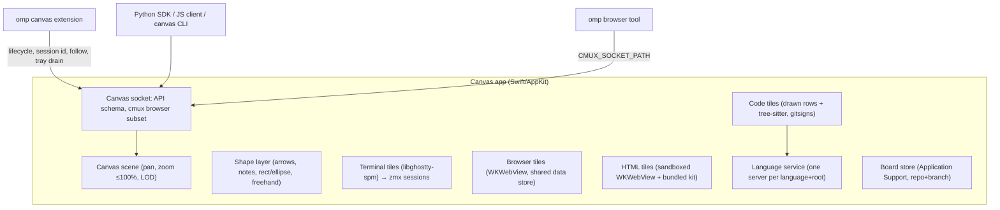

# Canvas — design record

A native macOS infinite canvas where coding agents run unmodified in real terminal tiles, next to browser, code/diff, note, and HTML tiles that both you and the agents can read, create, and change. The transcript stays in the agent's own terminal UI; the canvas holds the current working state.

Source: the original brainstorm (private) and the grilling session that produced this record.

## Principles

- **Terminal-first.** Agents (omp first) run their real TUI in a terminal tile. We never rebuild the agent's UI; every omp command, login flow, and question tool keeps working.
- **Own our protocols.** Depend only on public, intended interfaces: omp's extension API, AppKit/WebKit, libghostty-spm (pinned), the zmx CLI. Never impersonate another product. One sanctioned exception: the browser speaks a cmux-compatible socket subset so omp's native `browser` tool drives our tiles (revisit later).
- **Grounded, not decorative.** Code shown on the canvas comes from real files and real language-server answers. Authored content (notes, free-written snippets, HTML) is visibly styled as authored.
- **Cheap on a shared machine.** Lazy everything, bounded concurrency, detach what you can't see. Resource budget is a first-class requirement (see Performance).

## Architecture



## Decisions

### Interaction

| Input | Action |
| --- | --- |
| Click | Select to edit, move, drag |
| Right-click | Context menu |
| Shift-click | Add/remove from selection |
| Drag on empty canvas | Marquee select (box or lasso, a setting) |
| Hyper-click (Caps Lock → ⌃⌥⇧⌘ via Karabiner) | Stage/unstage a mention |
| Hyper-drag on empty canvas | Marquee mention (one group mention) |
| Hold Hyper | Outline what would be mentioned under the cursor |
| ⌘G / double-click group | Named group; double-click enters it (zoom + dim the rest) |
| ⌘P | Go to… navigator (see Navigation) |
| ⌘= / ⌘- / ⌘0 / ⌘9 | Zoom in / zoom out / actual size (100%) / zoom to fit |

- Hyper is caught by an app-level event monitor before any tile, so native ⌘-click keeps working everywhere (terminal links, browser new-tab, go-to-definition).
- Mentions work at element level inside tiles: DOM element, code line or symbol, terminal line/selection, any canvas object.
- **Selection tray**: a fixed window-space bar showing staged mentions as chips and which terminal will receive them. Staging is explicit and never undone automatically: edits keep the chip (with an "edited" badge), deleting the object or closing its tab removes it, the chip's X removes it.
- **Drain**: the omp extension attaches all staged mentions (pinned to their revision at submit time) to the next prompt you actually submit, then clears the tray. Synthetic turns (queued follow-ups, advisor, background-job wakes) never drain. Other agents: a hotkey pastes the tray as tokens, or `canvas tray drain`.
- **Prompting**: keyboard focus stays in the target terminal while the mouse draws and selects; Superwhisper pastes into that terminal. No in-app composer, no in-app voice.
- Your ink never means anything by itself. When you mention a drawn object, the canvas resolves what it encloses, overlaps, and connects; the agent reads that as structure (`--as graph`) or a picture (`canvas render <id>`).

### Canvas and drawing

- Native AppKit scene; tiles are real NSViews in one coordinate system with a vector overlay above them.
- Our own shape layer, not tldraw (source-available license, web-only): arrows bound to objects, notes, text, rectangle/ellipse, freehand ink. Hand-drawn feel from MIT/OFL parts (perfect-freehand, rough.js ideas, Shantell Sans). No tldraw code or assets.
- One object type for user and agent. Every object records creator and edit history. Agents may edit and move your objects when you're collaborating (guided by the shipped skill); every agent change is undoable with ⌘Z. Agents never move your viewport unless you ask; they can raise an attention marker instead.
- Agent-created objects spawn near the agent's terminal. Automatic spawns are limited to the agent's follow tile and its browser.
- **Zoom**: capped at 100%. Zooming never redraws the scene: tiles, group titles and borders, drawings, and selection rings are all in document space and keep their size relative to everything else at every zoom (only window chrome, the dot grid, shape resize handles, and attention markers stay screen-sized). An attention marker is the one thing that must stay readable from anywhere, so it lives in a window-space layer above the canvas and is re-placed around its object on every pan and pinch step: it hugs the object smoothly through a pinch, at a fixed on-screen size. Below ~30% (terminals ~15%) tiles become snapshot or title cards and live views detach (Ghostty occlusion, WebKit suspension). Cards look exactly like the live tile: code cards draw the tile's own header view and its rows at its scroll, HTML and browser cards are captures of the live page. A card replaces the live view only once it has been drawn (never a blank or title-only flash); going live, the card stays over the content until the content is ready (a web page loaded, settled, and presented, at most 2 s), so the swap never shows a blank or half-loaded page; and flips have hysteresis (cards below 90% of the live zoom; offscreen past 600 pt, live again within 300 pt). Below 30% every tile is one handle (click selects, drag moves) with its agent's lifecycle wash. The dot grid is a Core Animation layer behind the document that follows every pan and pinch step: dots stay 2 pt on screen and the next finer level fades in and out (`RenderMath.gridLevel`), so zooming never pops them. "Zoom in" means focusing a tile at 100%.
- **Scale**: nothing grows by itself to stay readable when you zoom out; you make an object bigger. A plain corner drag resizes a tile and its content reflows; ⌥-drag scales it: the proportions and layout stay, and everything inside (title bar, text, page, terminal) grows with the box. The right-click menu's Scale submenu has 50–200% and Reset. A text shape's corner always scales it, box and font together. The scale is `props.scale` (0.25–8), so agents can set and read it too. A scaled-up tile stays live further out, because its content is bigger on screen. Code, note, and web content redraws sharp at any scale; a terminal above 100% on screen is magnified from Ghostty's surface, as when zooming in.
- One canvas per directory (repo or worktree); tiles may override the root.

### Navigation

Getting lost on a big board must always have a one-step way back.

- **Go to… (⌘P)**: a floating panel inside the board window (an overlay like the drawing toolbar, not a separate window and never modal) with a search field and a list: "All content" first (Zoom to Fit), then groups by title, then tiles, each in reading order (top to bottom, then left to right). A tile row shows its title (code: path and line range; notes: their first line), a small type label, and the agent lifecycle dot for terminals. Typing filters by case-insensitive substring; ↑/↓ move, Return or a click goes, Esc, ⌘P, or a click outside closes. Going fits the object (zoom capped at 100%) and selects it; a terminal also takes keyboard focus. The move is a jump, not an animation: every intermediate frame would run the scene pass (live/card flips, grid and chrome rescales) across whatever the path crosses. ⌘P rather than ⌘K because Ghostty binds ⌘K (clear screen) by default and a focused terminal tile claims it before the menu.
- **Nothing here**: while the board has objects but none intersects the viewport, a pill at the bottom center says "Nothing here · Back to content"; its button runs Zoom to Fit. The scene pass decides it, stopping at the first object in view.
- **Zoom to Fit (⌘9)** fits everything when all of it fits at minimum zoom (10%). Otherwise it fits the largest cluster: objects whose frames lie within 1500 pt of each other, transitively (`Layout.clusters`); largest means most objects, then most area (`Layout.fitTarget`). Two stray terminals 40,000 pt from the other 130 objects used to clamp the fit at 10% centered on the empty space between them; now they're left out of it.

### Tiles

- **Terminal**: libghostty-spm surface running `zmx attach <session> <cmd>`. Agents survive app quit, crash, and rebuild; after a reboot, agent tiles relaunch with their recorded session (`omp --resume=<id>`).
- **Browser**: WKWebView, all tiles share one website data store (one browser profile, separate screens). Created lazily; snapshotted and detached when not visible. omp's native `browser` tool drives them through the cmux-compatible subset (`browser.open_split` spawns a tile beside the calling terminal).
- **Code**: read-only, one view (no diff/source modes): the whole current file scrolled to its range, with changes against the diff base (merge-base with the default branch by default, or HEAD) shown in context like nvim gitsigns: a green bar on added lines, blue on modified, a red wedge where lines were deleted; clicking a sign peeks the base lines inline. No commits, no default branch, or a diff too large shows plain source with a header warning; a deleted file shows its base version. Diff engine: `git diff --diff-algorithm=histogram` against a pinned base SHA; model follows VS Code's range mappings; both sides are highlighted with tree-sitter. Rows are drawn directly (a CTLine per visible row, `CodeMetrics` geometry), not by a text system, and long lines soft-wrap at the tile's width (no sideways scrolling); `size: "fit"` caps a code tile's width (960 pt by default) instead of stretching it to the longest line. "Edit here" opens nvim at file:line in a terminal tile.
  - **Follow mode**: each agent terminal has one follow tile that re-aims at the latest file:line it read, edited, or wrote, with a short history strip; the rows an edit or write changed flash for ~3 s. While the user scrolls, clicks, or selects in it, re-aims wait ~10 s ("N new ▸" catches up). Pin turns the current view into a permanent code tile.
  - Minimal editor features: hover signature, symbol highlight, go to definition (same tile or new tile), references, next/previous change, outline, canvas actions such as "open callers as graph".
- **Notes**: markdown. Code fences have three modes, all plain markdown for agents:
  - Excerpt: ```` ```ts file=path#L10-40 ```` or `symbol=Name`, rendered live from disk with full language features.
  - Proposed change: same anchor plus `propose`, rendered as a diff against the real range.
  - Free-written: plain fence, highlighted; `file:line` links resolve, identifiers get best-effort workspace-symbol navigation.
  - Anchors prefer symbols, re-find line anchors by content, show a stale badge when lost, and can be pinned to a commit.
- **HTML**: sandboxed WKWebView with a throwaway data store, network blocked by default (content rule list, per-tile allowlist), no native bridge except a validated message channel for tile state. Approvals never render inside generated tiles. Every tile preloads a locally served kit: Tailwind (themed to the app), Mermaid, and canvas web components (`<canvas-code>`, `<canvas-link>`, `<canvas-decisions>`, `<canvas-compare>`).

### Agent layer

- Ours, under the `CANVAS_*` environment namespace (plus `CMUX_*` for the browser only).
- Lifecycle per terminal tile: `working`, `blocked`, `idle`, `done` (idle, not yet seen), `unknown`. Sources: our omp extension (authoritative); our own hook scripts for Claude Code and Codex (modeled on how herdr does it). No screen scraping in v0.
- "Seen" means the tile was focused, or visible at readable zoom in the frontmost window for a few seconds.
- Session memory: each tile records agent kind and session id for resume.
- Agent-to-agent: `canvas agent list|prompt|wait|read`, across all canvases in the app.
- Notifications: tile badges, lifecycle color on zoomed-out cards, macOS notifications when the app is not frontmost.

### Language service

- The app owns its language servers: one per (language, root), lazy start, idle shutdown, shared by all tiles. Tree-sitter parses are cached per file (path + content hash).
  - Root: the nearest project marker above the file (Package.swift, pyproject.toml, tsconfig.json/package.json, go.mod, Cargo.toml, …), never above the board root. Servers: sourcekit-lsp, pyright-langserver, typescript-language-server, gopls, rust-analyzer; a missing binary is reported as unavailable.
  - Binaries and PATH come from the login shell (`$SHELL -lc`), resolved once: GUI apps get launchd's minimal PATH, and script servers (pyright) need node on it.
  - Idle shutdown after 5 minutes without requests; at most 4 servers at once (least recently used stops first, even mid-initialize). Quit waits for every server to exit (exit, SIGTERM, SIGKILL after 2 s). A crashed server surfaces its exit reason and restarts on the next request.
  - Documents are client-owned only while a request needs them or a code view shows them (ref-counted); before every request each open document whose file changed on disk is re-sent (full didChange), so no file watching is needed and closed files are read from disk by the server.
  - Code views implement `CodeNavigationHost`; `CodeNavigation` adds hover (500 ms, cancelled on move), ⌘-click definition (same file re-aims the tile, other files open a tile beside it, ⌥⌘ always opens one), Find References and Outline. Their popovers live in the canvas document, so they pan/zoom with the tile, never take focus, and appear in `view.snapshot`.
  - sourcekit-lsp runs with background indexing off (`initializationOptions.backgroundIndexing: false`): on a shared machine, opening a code tile must never start a `swift build` in the user's repo. Definitions and references come from the index the user's own builds write (SwiftPM indexes debug builds), and an empty answer says so. Until SwiftPM has loaded the package, sourcekit-lsp answers from fallback settings that can't see other files.
- omp keeps its own servers for now. Later: `canvas lsp-proxy <server>` configured as omp's server command, so each root runs one server.

### API and clients

- The **API schema** (method catalog over the Unix socket) is the single source of truth.
- v0 clients, generated or thin over the schema:
  - **Python SDK**: first-class, recommended for any agent with a persistent REPL.
  - **CLI**: for agents without a REPL.
  - **TS client**: used by the omp extension and usable from JS eval.
- MCP later, as another wrapper over the same schema.
- A shared `~/.canvas/compositions/` folder, auto-imported by both SDKs, holds reusable helpers agents write and improve; each SDK also ships its own built-in compositions, which user ones shadow by name.
- The shipped default skill (`skills/canvas`): persistent REPL → Python SDK; otherwise → CLI; touch user objects only when the user is collaborating. omp's skill discovery can't be extended by an extension, so the omp extension announces the skill (name, description, absolute path) in the system prompt only when `CANVAS_ENV=1`; nothing is added to the user's global omp config.

### Persistence

- Terminals: zmx sessions.
- Boards: `~/Library/Application Support/Canvas/boards/`, keyed by the repo's shared git directory plus branch/worktree. Boards survive worktree deletion as archived boards; "export to repo" commits one on request.

## Performance

- Git: one invocation per canvas root for all visible files, merge-base resolved once and re-resolved on HEAD/branch change, triggered by debounced FSEvents, only for live tiles, cached by (base SHA, content hash), at most two concurrent git processes app-wide.
- Terminals: a surface renders only while its tile is live and its window visible; offscreen, zoomed out below 15%, covered, minimized, and other-Space windows all stop Ghostty drawing, and the zmx session keeps running. Between 15% and 30% a terminal stays live, still updating, instead of swapping to a redraw in another font. Browsers: detach and snapshot when not visible, with a capped snapshot pixel budget; a page an agent is driving stays visible to WebKit for 60 s after its last command.
- Cards are 0.6 px/pt bitmaps, dropped as soon as the tile is live again; terminal cards read `zmx history` on GCD, not the main thread.
- Notes lay out their whole text once per content change (`NoteDisplayView`). TextKit 2 otherwise lays out a viewport around what's visible, and on the canvas that followed every pan and pinch step: each step re-laid out and resized every note on screen, sometimes never converging. One note on the astra replica stalled a pinch for 2 s (the "application not responding" beachball) and once raised AppKit's layout-loop exception.
- `view.render` encodes its image off the main thread (a full-board PNG took ~300 ms of the canvas's main thread).
- Blocking work (subprocess pipes, `waitUntilExit`, file reads) never runs inside a Swift task: parked cooperative threads starve the socket servers' request tasks. Use GCD plus a continuation.
- Agent-built boards (the architecture explainer: one 128-op `object.batch` creating 67 fit code tiles, 3 notes, an HTML tile, 10 groups, 38 line-bound `avoid` arrows, 8 grids and a stack). `layout.check` judges a value snapshot of the board (`BoardGeometry`): it reads each file once and wraps it once per width, concurrently, only for tiles line-bound arrows attach to, and routes, labels, and code fit run off the main actor. New code, note, and HTML tiles that wouldn't be live start as their cards (no live view, no header controls, no load), code headers build their AppKit controls only in a window, background model and card installs run one per main turn (`MainTurns`), and `avoid` arrows touched during a burst route once in the settle instead of per change. Measured on a replica (debug build, `scripts/perf-replica.sh`, board zoomed to fit, a 1500-step scroll burst running during each call; `longest gap` is the main-thread stall):

  | Call | Before (b22714e) | After |
  | --- | --- | --- |
  | `object.batch` (128 ops) | 0.54 s, stall 1094 ms | 0.19 s, stall 135 ms |
  | `board.get` right after | 0.04 s, stall 26 ms | 0.05 s, stall 47 ms |
  | `layout.check`, whole board | 2.6–3.7 s (8.0 s on 2b87650), stall 327–958 ms | 0.08 s, stall 18–34 ms |

  The reports are identical (whole board, `ids`, and `rect` on a perturbed copy with overlaps, crossings, label overlaps, overflow, and a truncated caption). The live session's 30 s batch and 65 s `board.get` did not reproduce on b22714e or 2b87650 on this replica.
- Language servers: lazy start, idle shutdown.

### Optimization spike (measured)

Command Line Tools ship no Instruments, so the spike measured with `footprint`, `top`, `ps` CPU time, and A/B builds on a dev instance.

| What | Before | After |
| --- | --- | --- |
| Agent-like status line (20 redraws/s, 20 s) in a live terminal, window on another Space | 0.93 s CPU | 0.04 s CPU |
| 12 tiles zoomed out and back in: card images held | 126 MB | 13 MB while zoomed out, <1 MB after |
| Zoom-out with N terminals: main-thread `zmx history` calls | N × ~40 ms | 0 |

Code tiles (astra-skyblock replica, 205 objects with 62 code tiles; every code tile visited at 100% and back to fit, then a fixed pan/zoom sequence with three ⌘9↔⌘0 transitions): the TextKit 2 tile left the app at 559 MB footprint (+267 MB over the fresh board, ~4.3 MB per code tile) and spent 5.19 s CPU on the sequence; drawing only visible rows from a compact model (no NSScrollView, nothing in the window while not live) leaves it at 319 MB (+19 MB, ~0.3 MB per tile) and 2.93 s CPU.

Standing costs, measured: empty board 46 MB and ~0% idle CPU. The first Ghostty surface adds ~224 MB of GPU memory (28 × 8 MiB Metal allocations, independent of size; Ghostty.app shows the identical pattern), each further terminal ~12 MB plus ~23 MB of triple-buffered IOSurfaces while it renders (860×560 pt), released when not live. Code tile +20 MB (1,000-line Swift file), note +6 MB, HTML tile +13 MB in-app plus ~23 MB WebContent, browser tile ~18 MB WebContent. Heavy terminal output costs zmx (the session relay) far more CPU than Canvas: a 9M-line burst took 2.6–4.5 s of zmx CPU and ≤0.14 s of Canvas CPU.

## v0 acceptance

Real use on real repos with the logged-in omp, not mocks:

1. **Grounded work loop**: omp in a terminal tile does a real task in a worktree; its follow tile shows reads and edits with merge-base gutter signs; it verifies the change in a visible browser tile.
2. **Mention loop**: Hyper-click a change in a code tile, a DOM element, and a drawn box; dictate a question into the terminal; the prompt drains the tray; the agent answers by editing or annotating objects.
3. **HTML explainer**: the agent (or a subagent) builds a sandboxed HTML tile with grounded `<canvas-code>` excerpts and file:line links that open code tiles.
4. **Survive rebuild**: quit or rebuild mid-task; agents keep running under zmx; the board restores exactly; after a reboot omp tiles resume their sessions.

Testing runs on an empty yabai workspace (or floating behind active windows), maximized rather than fullscreen, coordinated with other herdr agents.

## Build plan

1. This record plus contracts (API schema, board object model, tile protocol).
2. Walking skeleton: canvas + one zmx-backed Ghostty terminal running omp + the extension draining a Hyper-click mention + one code tile.
3. Parallel slices on proven contracts, each with behavior tests and a reviewer: drawing, browser + cmux subset, diff/code tiles, language service, HTML tiles + kit, SDK/CLI, persistence.
4. Acceptance smoke tests.
5. Resource-optimization spike.

## Deferred

Question cards (`canvas_ask`), MCP server, `canvas lsp-proxy`, multi-agent overview as an acceptance gate, runtime stack-trace and flame-graph tiles (DAP/profiler), extension-registered omp browser backend (would replace the cmux subset), screen-scraping lifecycle detection.

## Skeleton findings

- omp `input` events carry `source: "interactive" | "rpc" | "extension"`; the extension drains only on interactive submits. Text pasted into the TUI by `agent.prompt` counts as interactive, so an API prompt drains the tray too.
- Hyper interception: the app-level local monitor sees ⌃-containing left clicks as `leftMouseDown` and consumes them, so AppKit's ⌃-click → context-menu path never runs. Verified with events replayed into the app's own queue; not yet with hardware clicks.
- zmx: bracketed paste passes through (a pasted prompt plus Enter arrives as one submit). Sockets live under `$TMPDIR/zmx-<uid>`; GUI apps get a long `/var/folders/…` TMPDIR, which caps session names at 46 bytes, hence `canvas-<tileId>` with board/tile labels. Kitty image restore on reattach is unsupported.
- libghostty-spm builds and links with Command Line Tools only. Ghostty renders through Metal, which `cacheDisplay` can't capture; terminal snapshots are drawn from the zmx session text.
- A window on an unviewed space (or fully covered) stops redrawing, so window-server captures go stale. `view.snapshot` renders the window in-process instead, which also lets agents see the canvas as the user does.
- TextKit 2 text views draw their text into per-fragment layers, which `cacheDisplay` (and so `view.snapshot`) never captures, and on an unviewed Space the fragment views aren't even created until `textViewportLayoutController.layoutViewport()` runs. Code tiles later dropped TextKit for rows they draw themselves (`CodeRowsView`), which `cacheDisplay` captures directly.

## Acceptance findings

Run on a clone of `3d-game` with Tim's omp 18.3: omp added an FPS/position HUD, followed by a mention-driven follow-up and an HTML explainer. Fixed along the way:

- Follow tiles re-aimed at scratch files (a `/tmp` screenshot the agent read). `follow.report` now ignores paths outside the board root and the terminal's cwd.
- omp's browser check saw `document.hidden` and a stopped `requestAnimationFrame` (the tile was offscreen or the window on another Space). Agent-driven pages now stay visible to WebKit (window occlusion detection off, offscreen web views parked in a clipped stage view) for 60 s after the last command.
- Hyper-clicking a HUD with `pointer-events: none` mentioned the canvas beneath it. The hit test now retries with pointer events forced on and takes a text-bearing overlay.
- A box drawn over a browser tile said nothing about what it marked. Shape mentions now name the topmost object under them that contains them, with the region in its local units (`· over browser obj_… at (240, 200) 125×120`).
- Rebuild and reboot resume held: after killing the zmx session and relaunching, the tile ran `omp --resume=<id>` and omp still knew the session's changes.
