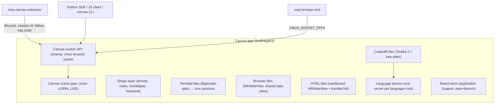

# Canvas — design record

A native macOS infinite canvas where coding agents run unmodified in real terminal tiles, next to browser, code/diff, note, and HTML tiles that both you and the agents can read, create, and change. The transcript stays in the agent's own terminal UI; the canvas holds the current working state.

Source conversation: `chatgpt-design-agent-harness.md` (original idea) and the grilling session that produced this record.

## Principles

- **Terminal-first.** Agents (omp first) run their real TUI in a terminal tile. We never rebuild the agent's UI; every omp command, login flow, and question tool keeps working.
- **Own our protocols.** Depend only on public, intended interfaces: omp's extension API, AppKit/WebKit, libghostty-spm (pinned), the zmx CLI. Never impersonate another product. One sanctioned exception: the browser speaks a cmux-compatible socket subset so omp's native `browser` tool drives our tiles (revisit later).
- **Grounded, not decorative.** Code shown on the canvas comes from real files and real language-server answers. Authored content (notes, free-written snippets, HTML) is visibly styled as authored.
- **Cheap on a shared machine.** Lazy everything, bounded concurrency, detach what you can't see. Resource budget is a first-class requirement (see Performance).

## Architecture



## Decisions

### Interaction

| Input | Action |
| --- | --- |
| Click | Select to edit, move, drag |
| Right-click | Context menu |
| Shift-click | Add/remove from selection |
| Drag on empty canvas | Marquee select (box or lasso, a setting) |
| Hyper-click (Caps Lock → ⌃⌥⇧⌘ via Karabiner) | Stage/unstage a mention |
| Hyper-drag on empty canvas | Marquee mention (one group mention) |
| Hold Hyper | Outline what would be mentioned under the cursor |
| ⌘G / double-click group | Named group; double-click enters it (zoom + dim the rest) |

- Hyper is caught by an app-level event monitor before any tile, so native ⌘-click keeps working everywhere (terminal links, browser new-tab, go-to-definition).
- Mentions work at element level inside tiles: DOM element, code line or symbol, terminal line/selection, any canvas object.
- **Selection tray**: a fixed window-space bar showing staged mentions as chips and which terminal will receive them. Staging is explicit and never undone automatically: edits keep the chip (with an "edited" badge), deleting the object or closing its tab removes it, the chip's X removes it.
- **Drain**: the omp extension attaches all staged mentions (pinned to their revision at submit time) to the next prompt you actually submit, then clears the tray. Synthetic turns (queued follow-ups, advisor, background-job wakes) never drain. Other agents: a hotkey pastes the tray as tokens, or `canvas tray drain`.
- **Prompting**: keyboard focus stays in the target terminal while the mouse draws and selects; Superwhisper pastes into that terminal. No in-app composer, no in-app voice.
- Your ink never means anything by itself. When you mention a drawn object, the canvas resolves what it encloses, overlaps, and connects; the agent reads that as structure (`--as graph`) or a crop (`--as image`).

### Canvas and drawing

- Native AppKit scene; tiles are real NSViews in one coordinate system with a vector overlay above them.
- Our own shape layer, not tldraw (source-available license, web-only): arrows bound to objects, notes, text, rectangle/ellipse, freehand ink. Hand-drawn feel from MIT/OFL parts (perfect-freehand, rough.js ideas, Shantell Sans). No tldraw code or assets.
- One object type for user and agent. Every object records creator and edit history. Agents may edit and move your objects when you're collaborating (guided by the shipped skill); every agent change is undoable with ⌘Z. Agents never move your viewport unless you ask; they can raise an attention marker instead.
- Agent-created objects spawn near the agent's terminal. Automatic spawns are limited to the agent's follow tile and its browser.
- **Zoom**: capped at 100%. Below that the compositor shrinks live tiles; below ~30% tiles become snapshot or title cards and live views detach (Ghostty occlusion, WebKit suspension). "Zoom in" means focusing a tile at 100%.
- One canvas per directory (repo or worktree); tiles may override the root.

### Tiles

- **Terminal**: libghostty-spm surface running `zmx attach <session> <cmd>`. Agents survive app quit, crash, and rebuild; after a reboot, agent tiles relaunch with their recorded session (`omp --resume=<id>`).
- **Browser**: WKWebView, all tiles share one website data store (one browser profile, separate screens). Created lazily; snapshotted and detached when not visible. omp's native `browser` tool drives them through the cmux-compatible subset (`browser.open_split` spawns a tile beside the calling terminal).
- **Code/diff**: read-only TextKit 2 + tree-sitter. Default view is a git diff against the merge-base with the default branch. Diff engine: `git diff --diff-algorithm=histogram` against a pinned merge-base SHA; model follows VS Code's range mappings; display buffer contains real deleted and added rows mapped back to source; old and new sides are highlighted separately. "Edit here" opens nvim at file:line in a terminal tile.
  - **Follow mode**: each agent terminal has one follow tile that re-aims at the latest file:line it read or edited, with a short history strip. Pin turns the current view into a permanent diff tile.
  - Minimal editor features: hover signature, symbol highlight, go to definition (same tile or new tile), references, next/previous hunk, outline, canvas actions such as "open callers as graph".
- **Notes**: markdown. Code fences have three modes, all plain markdown for agents:
  - Excerpt: ```` ```ts file=path#L10-40 ```` or `symbol=Name`, rendered live from disk with full language features.
  - Proposed change: same anchor plus `propose`, rendered as a diff against the real range.
  - Free-written: plain fence, highlighted; `file:line` links resolve, identifiers get best-effort workspace-symbol navigation.
  - Anchors prefer symbols, re-find line anchors by content, show a stale badge when lost, and can be pinned to a commit.
- **HTML**: sandboxed WKWebView with a throwaway data store, network blocked by default (content rule list, per-tile allowlist), no native bridge except a validated message channel for tile state. Approvals never render inside generated tiles. Every tile preloads a locally served kit: Tailwind (themed to the app), Mermaid, and canvas web components (`<canvas-code>`, `<canvas-link>`, `<canvas-decisions>`, `<canvas-compare>`).

### Agent layer

- Ours, under the `CANVAS_*` environment namespace (plus `CMUX_*` for the browser only).
- Lifecycle per terminal tile: `working`, `blocked`, `idle`, `done` (idle, not yet seen), `unknown`. Sources: our omp extension (authoritative); our own hook scripts for Claude Code and Codex (modeled on how herdr does it). No screen scraping in v0.
- "Seen" means the tile was focused, or visible at readable zoom in the frontmost window for a few seconds.
- Session memory: each tile records agent kind and session id for resume.
- Agent-to-agent: `canvas agent list|prompt|wait|read`, across all canvases in the app.
- Notifications: tile badges, lifecycle color on zoomed-out cards, macOS notifications when the app is not frontmost.

### Language service

- The app owns its language servers: one per (language, root), lazy start, idle shutdown, shared by all tiles. Tree-sitter parses are cached per file (path + content hash).
- omp keeps its own servers for now. Later: `canvas lsp-proxy <server>` configured as omp's server command, so each root runs one server.

### API and clients

- The **API schema** (method catalog over the Unix socket) is the single source of truth.
- v0 clients, generated or thin over the schema:
  - **Python SDK**: first-class, recommended for any agent with a persistent REPL.
  - **CLI**: for agents without a REPL.
  - **TS client**: used by the omp extension and usable from JS eval.
- MCP later, as another wrapper over the same schema.
- A shared `~/.canvas/compositions/` folder, auto-imported by both SDKs, holds reusable helpers agents write and improve; each SDK also ships its own built-in compositions, which user ones shadow by name.
- The shipped default skill (`skills/canvas`): persistent REPL → Python SDK; otherwise → CLI; touch user objects only when the user is collaborating. omp's skill discovery can't be extended by an extension, so the omp extension announces the skill (name, description, absolute path) in the system prompt only when `CANVAS_ENV=1`; nothing is added to the user's global omp config.

### Persistence

- Terminals: zmx sessions.
- Boards: `~/Library/Application Support/Canvas/boards/`, keyed by the repo's shared git directory plus branch/worktree. Boards survive worktree deletion as archived boards; "export to repo" commits one on request.

## Performance

- Git: one invocation per canvas root for all visible files, merge-base resolved once and re-resolved on HEAD/branch change, triggered by debounced FSEvents, only for live tiles, cached by (base SHA, content hash), at most two concurrent git processes app-wide.
- Terminals: offscreen surfaces set occluded (Ghostty frees GPU buffers). Browsers: detach and snapshot when not visible, with a capped snapshot pixel budget.
- Language servers: lazy start, idle shutdown.
- A dedicated optimization spike closes the build: allocations, memory, threads, CPU, GPU, measured with Instruments/`sample`.

## v0 acceptance

Real use on real repos with the logged-in omp, not mocks:

1. **Grounded work loop**: omp in a terminal tile does a real task in a worktree; its follow tile shows reads and edits as merge-base diffs; it verifies the change in a visible browser tile.
2. **Mention loop**: Hyper-click a diff hunk, a DOM element, and a drawn box; dictate a question into the terminal; the prompt drains the tray; the agent answers by editing or annotating objects.
3. **HTML explainer**: the agent (or a subagent) builds a sandboxed HTML tile with grounded `<canvas-code>` excerpts and file:line links that open code tiles.
4. **Survive rebuild**: quit or rebuild mid-task; agents keep running under zmx; the board restores exactly; after a reboot omp tiles resume their sessions.

Testing runs on an empty yabai workspace (or floating behind active windows), maximized rather than fullscreen, coordinated with other herdr agents.

## Build plan

1. This record plus contracts (API schema, board object model, tile protocol).
2. Walking skeleton: canvas + one zmx-backed Ghostty terminal running omp + the extension draining a Hyper-click mention + one code tile.
3. Parallel slices on proven contracts, each with behavior tests and a reviewer: drawing, browser + cmux subset, diff/code tiles, language service, HTML tiles + kit, SDK/CLI, persistence.
4. Acceptance smoke tests.
5. Resource-optimization spike.

## Deferred

Question cards (`canvas_ask`), MCP server, `canvas lsp-proxy`, multi-agent overview as an acceptance gate, runtime stack-trace and flame-graph tiles (DAP/profiler), extension-registered omp browser backend (would replace the cmux subset), screen-scraping lifecycle detection.

## Skeleton findings

- omp `input` events carry `source: "interactive" | "rpc" | "extension"`; the extension drains only on interactive submits. Text pasted into the TUI by `agent.prompt` counts as interactive, so an API prompt drains the tray too.
- Hyper interception: the app-level local monitor sees ⌃-containing left clicks as `leftMouseDown` and consumes them, so AppKit's ⌃-click → context-menu path never runs. Verified with events replayed into the app's own queue; not yet with hardware clicks.
- zmx: bracketed paste passes through (a pasted prompt plus Enter arrives as one submit). Sockets live under `$TMPDIR/zmx-<uid>`; GUI apps get a long `/var/folders/…` TMPDIR, which caps session names at 46 bytes, hence `canvas-<tileId>` with board/tile labels. Kitty image restore on reattach is unsupported.
- libghostty-spm builds and links with Command Line Tools only. Ghostty renders through Metal, which `cacheDisplay` can't capture; terminal snapshots are drawn from the zmx session text.
- A window on an unviewed space (or fully covered) stops redrawing, so window-server captures go stale. `view.snapshot` renders the window in-process instead, which also lets agents see the canvas as the user does.
